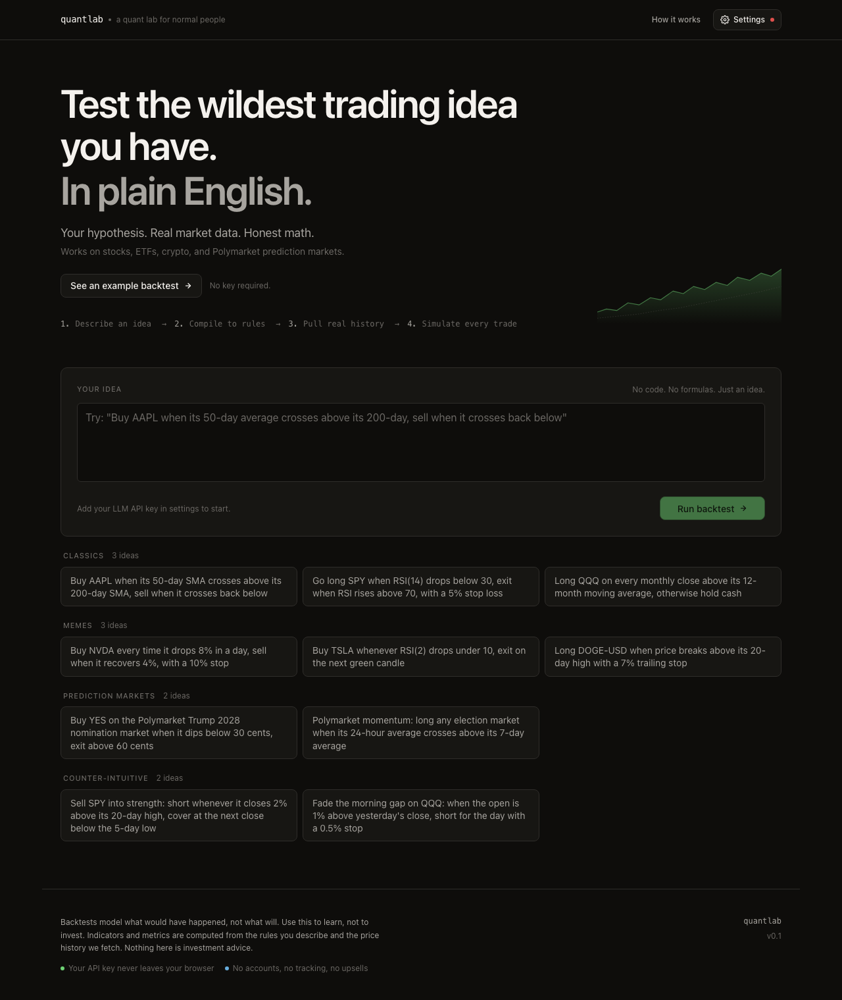

# quantlab

**A quant lab for normal people.** Describe a trading idea in plain English; get a real backtest in seconds.



- **Plain English is the interface.** "Buy AAPL when its 50-day average crosses above its 200-day, sell when it crosses back below" → a full backtest.
- **Bring your own LLM key** (OpenAI / Anthropic / Google). Never persisted server-side — it lives only in your browser.
- The LLM emits a **structured strategy DSL, not code** — no code generation, no `eval`.
- **Pure-TypeScript backtest engine** with free market data: Yahoo Finance (stocks, ETFs, crypto) and Polymarket (prediction markets).
- **Benchmark or it didn't happen** — every result is compared to buy-and-hold.

## Quick start

```bash
npm install
npm run dev
```

Open **http://localhost:3000**, click **Settings** to paste your LLM API key, then describe a strategy. No key handy? Click **"See an example backtest"** to render a full result with demo data.

There are no environment variables to set — the key is entered in the browser and sent per-request to your provider.

📖 **Full walkthrough with screenshots: [docs/USER_GUIDE.md](docs/USER_GUIDE.md)**

## Scripts

| Command | Description |
| --- | --- |
| `npm run dev` | Dev server on :3000 |
| `npm run build` / `npm run start` | Production build / serve |
| `npm run test` | Vitest suite |
| `npm run typecheck` | `tsc --noEmit` |
| `npm run lint` | `next lint` |

## Architecture

- `src/lib/strategy/` · strategy DSL schema (Zod) + interpreter
- `src/lib/backtest/` · engine, metrics, trade simulator, buy-and-hold benchmark
- `src/lib/data/` · market data adapters (Yahoo Finance, Polymarket)
- `src/lib/llm/` · multi-provider LLM adapter (Vercel AI SDK)
- `src/app/api/` · server routes (compile strategy, run backtest)
- `src/app/` + `src/components/` · UI (idea input, charts, metrics, trade log)

## Strategy DSL

The LLM emits JSON like:

```json
{
  "name": "SMA crossover",
  "asset": "AAPL",
  "timeframe": "1d",
  "indicators": [
    { "id": "fast", "type": "SMA", "source": "close", "period": 10 },
    { "id": "slow", "type": "SMA", "source": "close", "period": 50 }
  ],
  "entries": [
    { "side": "long", "when": { "op": "crosses_above", "left": "fast", "right": "slow" } }
  ],
  "exits": [
    { "when": { "op": "crosses_below", "left": "fast", "right": "slow" } }
  ],
  "risk": { "positionSizePct": 100, "stopLossPct": 5, "takeProfitPct": 10 }
}
```

This data, not code, drives the backtester · no sandbox required.

## Disclaimer

Backtests model what *would* have happened, not what *will*. This is a tool to learn with, not investment advice.
