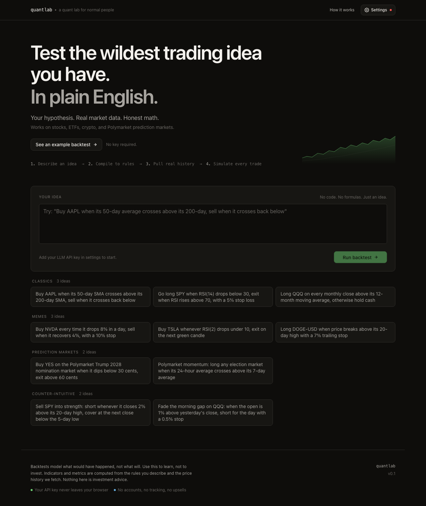

# quantlab

**A quant lab for normal people.** Describe a trading idea in plain English; get a real backtest in seconds.



- **Plain English is the interface.** "Buy AAPL when its 50-day average crosses above its 200-day, sell when it crosses back below" turns into a full backtest.
- **Bring your own LLM key** (OpenAI / Anthropic / Google). Never persisted server-side; it lives only in your browser.
- The LLM emits a **structured strategy DSL, not code**. No code generation, no `eval`.
- **Pure-TypeScript backtest engine** with free market data: Yahoo Finance (stocks, ETFs, crypto) and Polymarket (prediction markets).
- **Benchmark or it didn't happen.** Every result is compared to buy-and-hold.
- **Arbitrage tab** for Kalshi multi-leg parlays: prices the hedge against every leg, nets out the exchange's quadratic fee, and reports exactly how much of the exchange it covered. No API key — Kalshi market data is public.

## Quick start

```bash
npm install
npm run dev
```

Open **http://localhost:3000**, click **Settings** to paste your LLM API key, then describe a strategy. No key handy? Click **"See an example backtest"** to render a full result with demo data.

There are no environment variables to set. The key is entered in the browser and sent per-request to your provider.

Full walkthrough with screenshots: [docs/USER_GUIDE.md](docs/USER_GUIDE.md)

Hosted split: static UI on GitHub Pages, API on a home server behind a Cloudflare
tunnel. See [docs/DEPLOY.md](docs/DEPLOY.md).

## Scripts

| Command | Description |
| --- | --- |
| `npm run dev` | Dev server on :3000 |
| `npm run build` / `npm run start` | Production build / serve |
| `npm run build:static` | Static UI export for GitHub Pages (no API; see [docs/DEPLOY.md](docs/DEPLOY.md)) |
| `npm run test` | Vitest suite |
| `npm run typecheck` | `tsc --noEmit` |
| `npm run lint` | `next lint` |
| `npm run coverage` | Vitest suite with V8 coverage |
| `npm run bench` | Backtest engine benchmarks (10k / 100k / 1M bars) |
| `npm run eval` | LLM compiler eval harness over a 50-prompt corpus (needs an `EVAL_*` key; skips without one) |

## Architecture

- `src/lib/strategy/` · strategy DSL schema (Zod) + interpreter
- `src/lib/backtest/` · engine, metrics, buy-and-hold benchmark, Monte Carlo bootstrap, out-of-sample robustness split, golden regression fixtures
- `src/lib/data/` · market data adapters (Yahoo Finance, Polymarket) with shared timeout handling
- `src/lib/llm/` · multi-provider LLM adapter (Vercel AI SDK) + semantic validator with one-shot repair
- `src/lib/kalshi/` · public Kalshi market-data client (no key) + the published quadratic fee schedule
- `src/lib/arb/` · multi-leg parlay arbitrage pricing and the bounded exchange scan
- `src/app/api/` · server routes (compile strategy + run backtest; arb scan; per-IP rate limited, structured request logging)
- `src/app/` + `src/components/` · UI (idea input, charts, metrics, trade log, arb scanner)
- `evals/` · LLM compiler eval corpus and harness (separate Vitest config)

## Strategy DSL

The LLM emits JSON like:

```json
{
  "name": "SMA crossover",
  "asset": "AAPL",
  "timeframe": "1d",
  "indicators": [
    { "id": "fast", "type": "SMA", "source": "close", "period": 10 },
    { "id": "slow", "type": "SMA", "source": "close", "period": 50 }
  ],
  "entries": [
    { "side": "long", "when": { "op": "crosses_above", "left": "fast", "right": "slow" } }
  ],
  "exits": [
    { "when": { "op": "crosses_below", "left": "fast", "right": "slow" } }
  ],
  "risk": {
    "positionSizePct": 100,
    "stopLossPct": 5,
    "takeProfitPct": 10,
    "costs": { "commissionBps": 0, "slippageBps": 5, "borrowRateAnnualPct": 0 }
  }
}
```

This data, not code, drives the backtester · no sandbox required.

## Realism and robustness

- **Costs are on by default.** Every fill pays slippage (5 bps default) plus optional commission, and shorts accrue borrow. Stops and takes that gap past their level fill at the open, not at a price that never traded. On a seeded 6-year daily series, an SMA 20/50 crossover with 20 trades returns -3.52% frictionless but -5.43% with just the default slippage: a 1.91 percentage point drag and $168.63 in costs. The headline reports gross vs net whenever costs moved the outcome.
- **Robustness checks on every run with 5+ trades.** A seeded Monte Carlo bootstrap (1,000 reshuffles of your closed trades) draws a 5-95% equity fan and the odds of losing money, and a 70/30 in-sample vs out-of-sample split reports whether the edge holds, degrades, or collapses on data the strategy never saw.
- **The engine is tested hard.** Property-based tests (fast-check) assert no lookahead, fills inside the bar range, non-overlapping trades, and JSON-safe results across thousands of random strategies and price series; golden fixtures pin five full backtests bit-for-bit.
- **And it is fast.** On a laptop, the engine simulates 10k bars in about 1.2ms, 100k in about 17ms, and 1M in about 230ms; 30 years of daily bars takes about 1ms.

## Disclaimer

Backtests model what *would* have happened, not what *will*. This is a tool to learn with, not investment advice.
