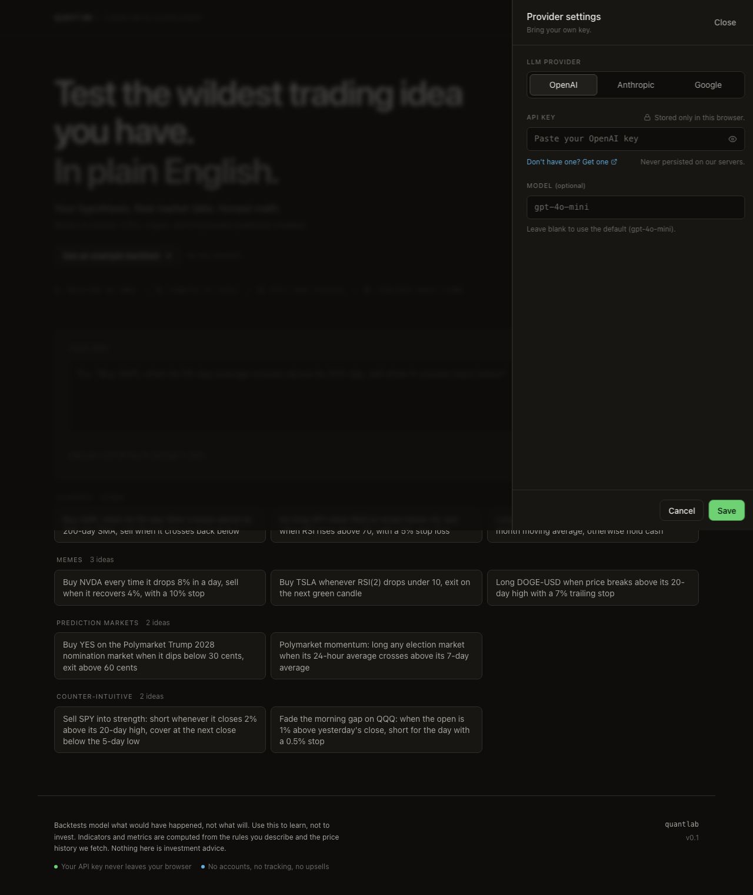
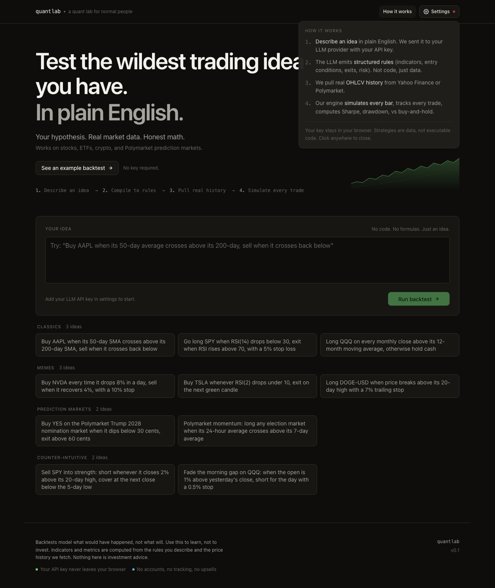
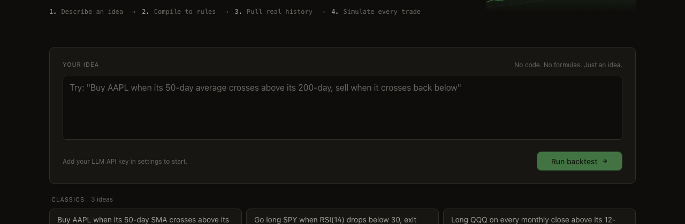
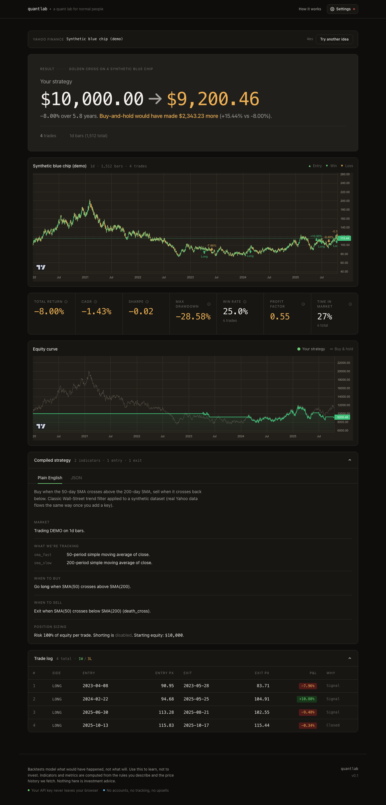
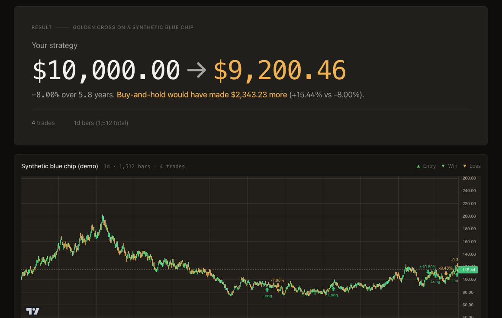
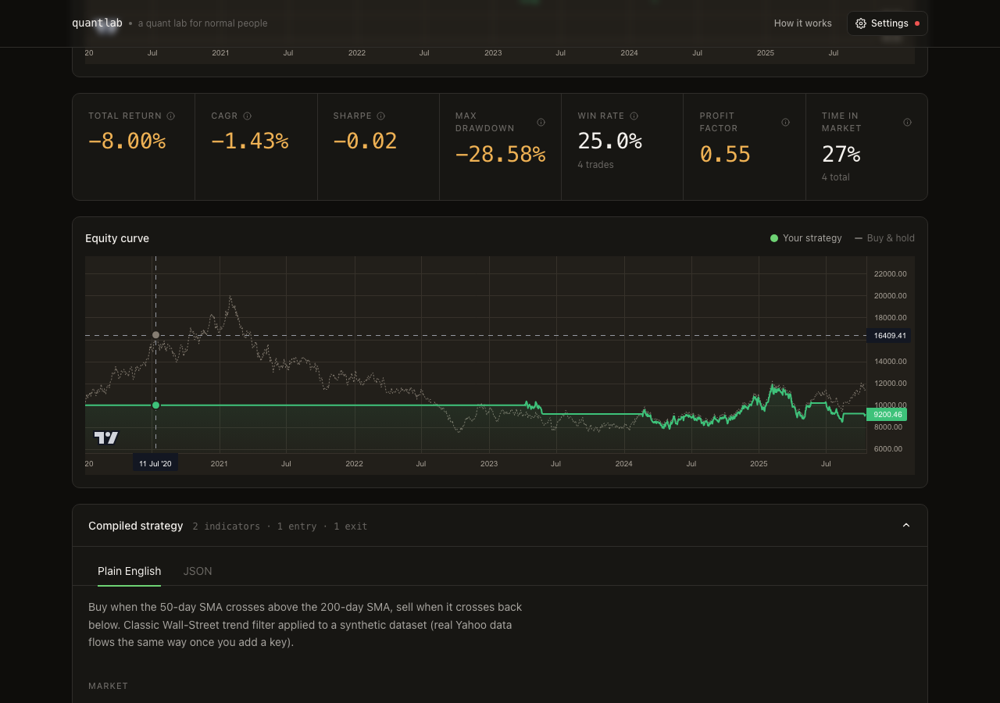
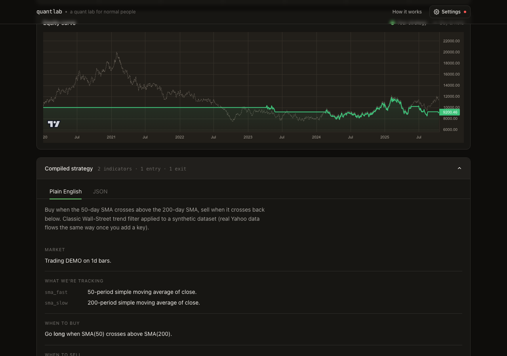
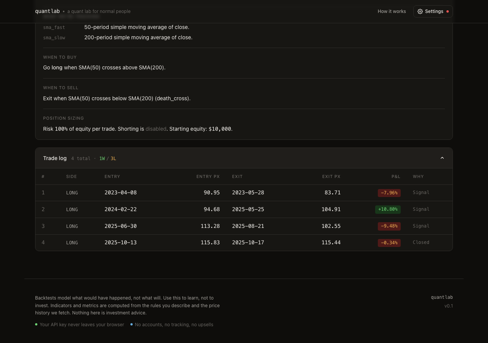
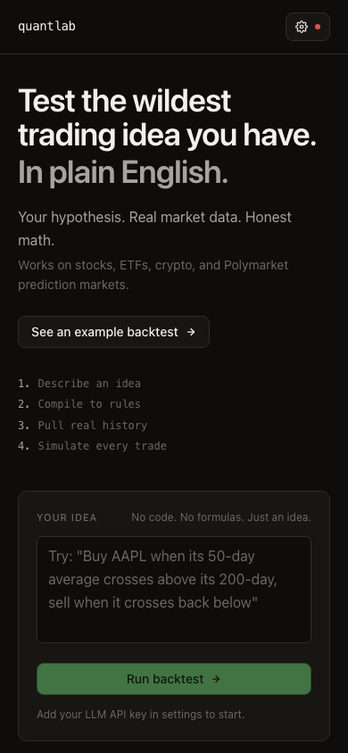

# quantlab User Guide

A quant lab for normal people. Describe a trading idea in plain English; get a real backtest in seconds.

This guide walks through what the app does, how to run it locally, and how to use every screen. All screenshots are from the running app and live in [`docs/screenshots`](./screenshots).

---

## What it is

quantlab turns a sentence into a rigorous backtest:

1. You **describe an idea** in plain English ("Buy AAPL when its 50-day average crosses above its 200-day, sell when it crosses back below").
2. Your **LLM** (OpenAI, Anthropic, or Google, with your key) compiles it into a structured strategy: indicators, entry/exit conditions, and risk rules. It emits **data, not code**. There is no `eval` and no code generation.
3. quantlab pulls **real OHLCV history** from Yahoo Finance (stocks, ETFs, crypto) or Polymarket (prediction markets).
4. A pure-TypeScript engine **simulates every bar**, tracks every trade, and computes Sharpe, drawdown, win rate, and a buy-and-hold benchmark.

Three principles shape it:

- **Plain English is the interface.** No JSON, no pandas.
- **Benchmark or it didn't happen.** Every result is compared to buy-and-hold.
- **Bring your own key, store nothing.** Your API key lives only in your browser. We never see or persist your key, prompts, or results.


---

## Running it locally

### Prerequisites

- **Node.js 18.17+** (developed on Node 20/22; Node 26 also works).
- **npm** (ships with Node).
- An **LLM API key** from one provider:
  - OpenAI: https://platform.openai.com/api-keys
  - Anthropic: https://console.anthropic.com/settings/keys
  - Google AI Studio: https://aistudio.google.com/app/apikey

> You do **not** need a key to look around. The **"See an example backtest"** button renders a full result with demo data.

### Steps

```bash
# 1. Clone and enter the repo
git clone <your-repo-url> algotrading
cd algotrading

# 2. Install dependencies
npm install

# 3. Start the dev server
npm run dev
```

Then open **http://localhost:3000**.

The app is a standard [Next.js](https://nextjs.org) 14 project. There are **no environment variables to set**. The API key is entered in the browser at runtime and sent per-request to your chosen provider. Nothing is stored server-side.

### Other commands

| Command | What it does |
| --- | --- |
| `npm run dev` | Start the dev server on port 3000 (hot reload). |
| `npm run build` | Production build. |
| `npm run start` | Serve the production build (run `build` first). |
| `npm run test` | Run the Vitest suite (engine, indicators, compiler, data). |
| `npm run typecheck` | TypeScript type-check with no emit. |
| `npm run lint` | ESLint via `next lint`. |

---

## Using the app

### 1. Add your provider key

Click **Settings** (top right). A red dot on the gear means no key is set yet.



- Pick a **provider**: OpenAI, Anthropic, or Google.
- Paste your **API key**. It is stored only in this browser's `localStorage` and sent per-request to the provider. The lock icon and "Stored only in this browser" copy are there to remind you.
- Optionally set a **model** (defaults: `gpt-4o-mini`, `claude-sonnet-4-6`, `gemini-2.0-flash`). Leave blank to use the default.
- Click **Save**.

### 2. (Optional) See how it works

The **How it works** button explains the four-step pipeline without leaving the page.



### 3. Describe an idea

Type your strategy into the **Your idea** box, or click one of the example chips grouped by theme: **Classics**, **Memes**, **Prediction markets**, and **Counter-intuitive**. Then press **Run backtest**.



Example ideas you can paste:

- `Buy AAPL when its 50-day SMA crosses above its 200-day SMA, sell when it crosses back below`
- `Go long SPY when RSI(14) drops below 30, exit when RSI rises above 70, with a 5% stop loss`
- `Buy NVDA every time it drops 8% in a day, sell when it recovers 4%, with a 10% stop`
- `Buy YES on the Polymarket Trump 2028 nomination market when it dips below 30 cents, exit above 60 cents`

### 4. Read the results

A full result has six parts. Here is the whole page for one run:



**Headline and price chart.** The bottom line first: what $10,000 became, over how long, and how that compares to buy-and-hold. The candlestick chart marks every entry and exit (green = win, amber = loss).



**Metrics and equity curve.** The standard quant scorecard (total return, CAGR, Sharpe, max drawdown, win rate, profit factor, time in market), then your equity curve plotted against the buy-and-hold benchmark.



**Compiled strategy.** Exactly what the LLM understood, in plain English (toggle to raw JSON if you want it). This is your check that the machine read your idea the way you meant it: indicators, entry rule, exit rule, and position sizing.



**Trade log.** Every simulated trade with entry/exit dates, prices, P&L, and the reason it closed (signal, stop, or end of data).



### Mobile

The layout is responsive down to phone widths.



---

## How a run flows through the code

```
Browser (your key in localStorage)
   |  POST /api/run  { prompt, provider, apiKey, model }
   v
src/app/api/run/route.ts        server route (key used in-memory only)
   |
   |- src/lib/llm/        compile plain English to strategy DSL (Vercel AI SDK)
   |- src/lib/strategy/   Zod schema + indicator evaluation (SMA, RSI, ...)
   |- src/lib/data/       fetch OHLCV from Yahoo Finance / Polymarket
   |- src/lib/backtest/   bar-by-bar simulation, metrics, buy-and-hold benchmark
   |
   v  { strategy, result }
Browser renders charts, metrics, trade log
```

- `src/lib/strategy/` · strategy DSL schema (Zod) + interpreter.
- `src/lib/backtest/` · engine, metrics, trade simulator, benchmark.
- `src/lib/data/` · market-data adapters (Yahoo Finance, Polymarket).
- `src/lib/llm/` · multi-provider LLM adapter (Vercel AI SDK).
- `src/app/api/` · server routes (compile strategy, run backtest).
- `src/app/` + `src/components/` · the UI you see above.

---

## Troubleshooting

| Symptom | Likely cause / fix |
| --- | --- |
| **Run failed: invalid API key / 401** | Wrong key for the selected provider, or key has no quota. Re-check in Settings. |
| **Run failed: model not found** | The custom model name isn't valid for that provider. Clear the Model field to use the default. |
| **"Add your LLM API key in settings to start."** | No key set. Open Settings and paste one. |
| **No data / unknown symbol** | The ticker isn't on Yahoo Finance, or the Polymarket market name didn't resolve. Try a well-known symbol. |
| **Port 3000 in use** | Run on another port: `npm run dev -- -p 3001`. |

---

## A note on what this is for

Backtests model what *would* have happened, not what *will*. Use this to learn, not to invest. Indicators and metrics are computed from the rules you describe and the price history fetched. Nothing here is investment advice.
